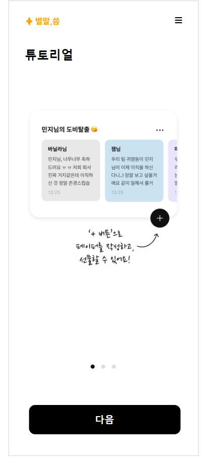
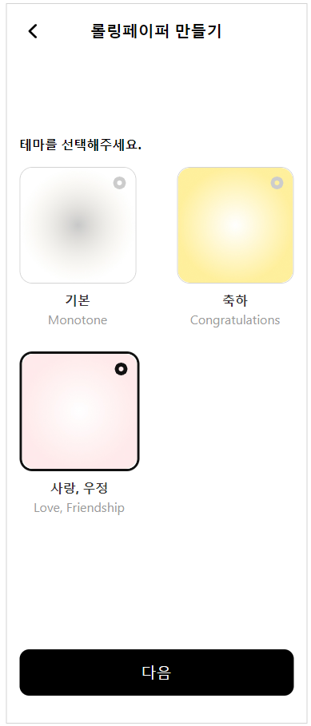
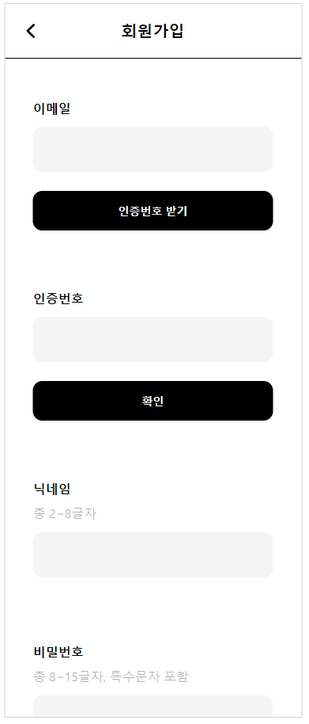
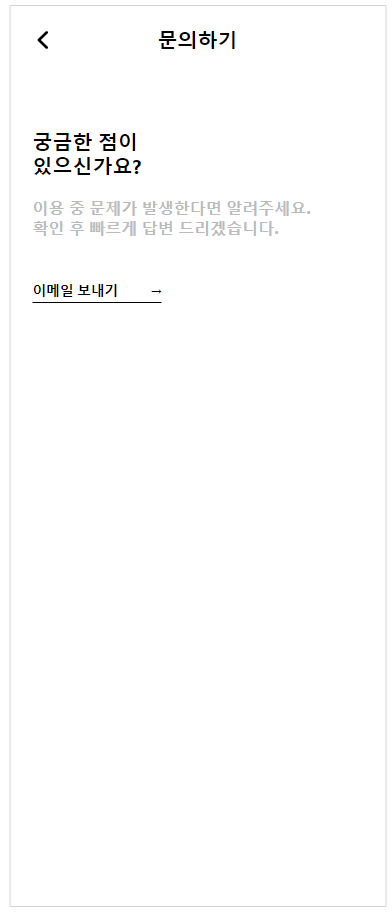
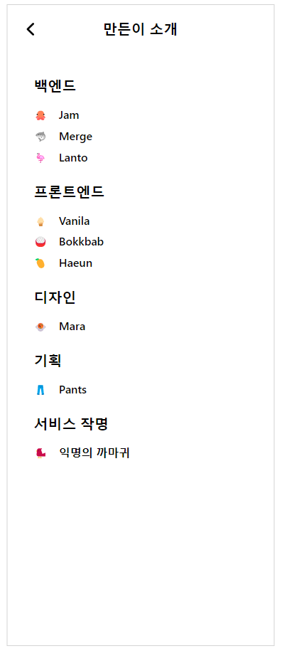

# 별말, 씀

## Introduce

> 소중한 사람들에게 짧지만, 특별한 진심을 전해보는 건 어떨까요?

- 처음이신가요? 처음인 유저분들을 위한 짧은 튜토리얼이 제공됩니다. 
 

- 다양하게 주어지는 기본 테마들 중에서 마음에 드는 테마를 선택해서 페이지를 만들 수 있어요.
 

- 회원가입을 통해 여러분의 진심들을 저장해주세요.
 

> 카카오 로그인 및 회원가입도 지원됩니다.

- 궁금한 점은 언제든지 문의하기 페이지를 이용해서 문의해주세요.
 

- 마지막으로 프로젝트를 위해 열심히 달려준 저희 팀원들을 소개합니다.
 

## how to run project

1. `git clone https://github.com/pullingoff/jtm-fe.git` : 깃허브 저장소 클론
2. `npm install` : package.json 기반으로 파일 의존성 설치
   - node version : 16
3. `npm start`: tsc-watch가 .ts를 .js로 컴파일한 후 변환에 모두 성공하면 `react-script start`
4. 추후 repo 에 내용이 업데이트 되면
   - `git pull`
   - `npm run start`

## 라이브러리 부가설명

- `tsc-watch`: ts 파일이 변경되는 걸 감시하면서 내용이 바뀔 때마다 js로 변환
- `node-sass`: .scss를 사용하기 위해 필요
- `styled-component`: CSS in JS, 재사용하기 편한 styled 컴포넌트를 만듦

- `npm i -D typescript @babel/core @babel/preset-env @babel/preset-typescript @typescript-eslint/eslint-plugin @typescript-eslint/parser eslint prettier eslint-plugin-prettier`: eslint를 사용할 때 install 해줘야 하는 목록들

 

## 변경 사항
1. 페이퍼 설정 실패 시, 왜 생성에 실패했는지 modal에 뜨게 함 (ex, 페이퍼 제목은 10자 미만으로 가능합니다 등)
2. 페이퍼 생성 시, 성공시에만 main으로 넘어가게 작업해둠. (페이퍼 이름 변경 시에도 성공 시에만 main으로 넘어가게 작업함)
3. 페이퍼 수정 component와 닉네임 수정 component의 padding값 맞춰둠.
